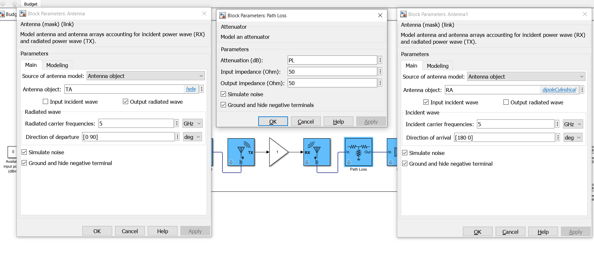
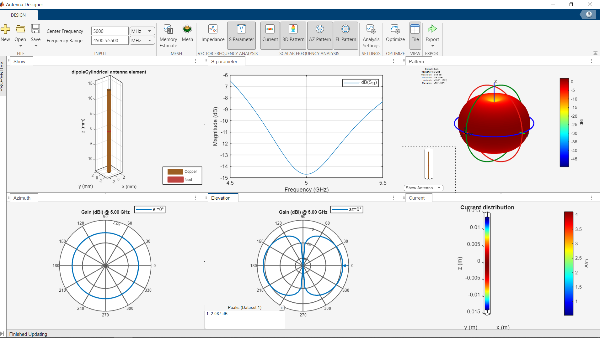
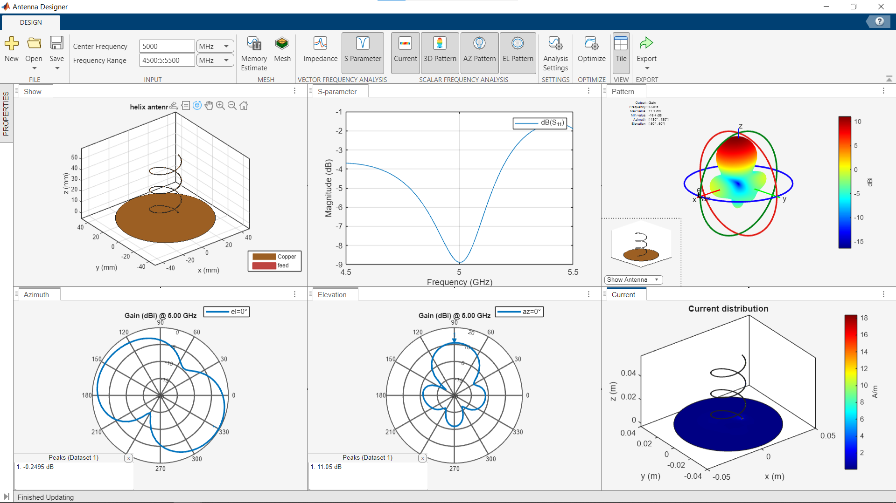
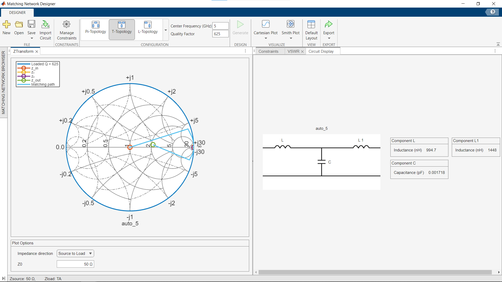
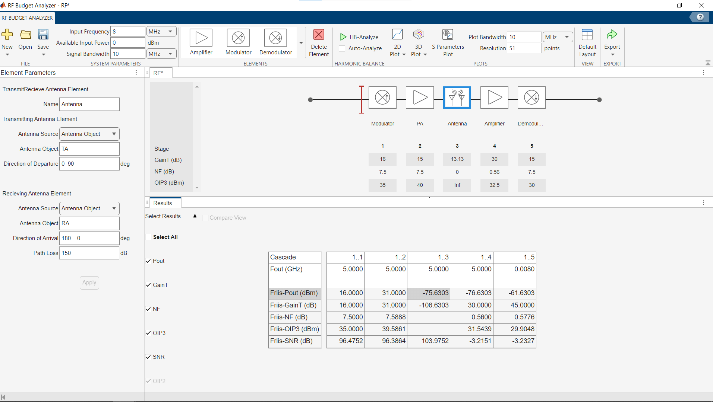

# UAV Video Link Budget Analysis

This project provides analysis and design of a UAV video communication link using various MATLAB toolboxes, codes, and Simulink models. The objective is to assess the performance of a video link between a moving Ground Control Station (GCS) and a UAV, which operates at 5 GHz. Design parameters were meticulously researched and selected based on established practices for such applications.

## System Block Diagram

This is the full block diagram of the system designed using Simulink. The design includes essential and complementary components such as Antennas, thermal noise, power amplifiers, and path loss models to accurately simulate a real-world scenario. The system diagram comprehensively illustrates the flow of the signal from the input to the output, ensuring a detailed understanding of each stage in the communication link. The output power available to the UAV is calculated to ensure optimal performance. One shall mention that the power at the receiver is of higher importance and is to be exploited shortly.

## Variables and Objects

The above image shows the variables and objects gathered from the workspace:
<ul>
    <li><strong>TA</strong>: Transmitter Antenna.</li>
    <li><strong>RA</strong>: Receiver Antenna.</li>
    <li><strong>PL</strong>: Path Loss.</li>
</ul>

## Path Loss Contour Plot

This contour plot shows the path loss for a use case where a GCS and UAV are communicating at 5 GHz. The <a href="https://github.com/HashemRawashdeh/UAV-Video-Link-Budget-Analysis/blob/main/Code/Channel.mlx">channel code</a> calculates the distance given the positions of the GCS and the UAV, including elevation, not just movements in the azimuth plane. The path loss value is calculated using the free space path loss model with a path loss exponent of 2, emulating a rural outdoor environment. This particular contour map shows an RX-TX distance of ~ 150km, mimicking a worst-case scenario for some very interesting practical applications.

## Receiver Antenna Design

This image shows the design of the receiver antenna. A dipole antenna was used for its pattern, simplicity, size, and cost. Its omnidirectional pattern is particularly of interest for such an application. The gain is irrelevant provided that the link budget concludes positively. A selected variety of plots are shown to validate what one presumes, and those one won't explain for one assumes the reader's inherent understanding of such a topic as this repository is more of a presentation rather than documentation of what transpired.

## Transmitter Antenna Design

This image shows the design of the transmitter antenna. Gain and directivity are paramount. They were sufficiently achieved.

## Matching Network Design

Impedances were not shown at the antenna level for they can be compensated for. This is an example of how that is done using the matching network designer app. One can then export this network's S-parameters and use them when needed.

## Budget Analysis

This image shows the budget analysis performed using the RF Budget Analyzer tool. The analysis includes the gain, noise figure, output power, and other important metrics for each stage of the communication link. This helps in identifying the performance bottlenecks and optimizing the system design. One can see the excellent power level at the receiving antenna, showing a viable communication link. This design is high level, simple and of an educational purpose.

